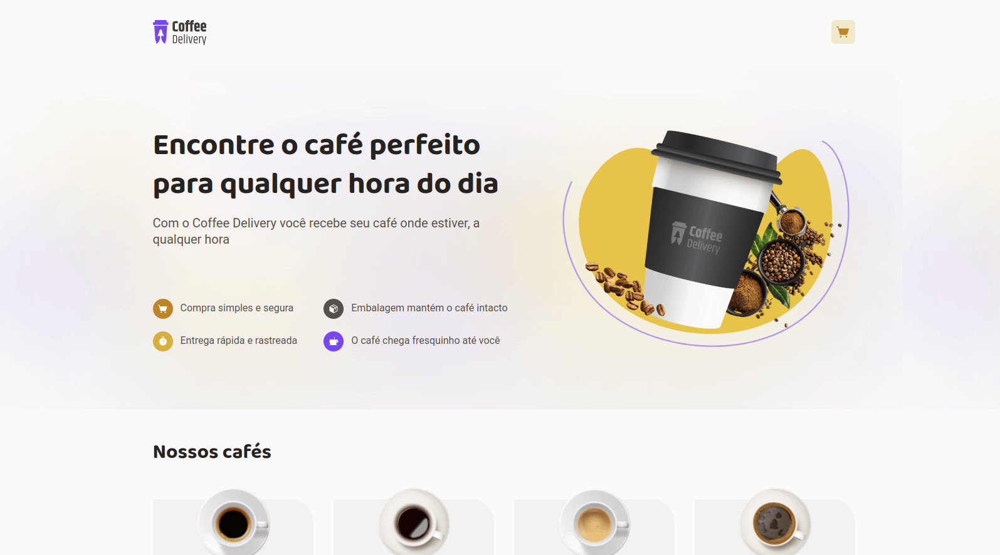

# Coffee Shop

Simple Web Store using TypeScript, styled-components, React with Reducers, Context API and immer, running on Vite.

## Screenshots



## Getting Started

```bash
# clone the repo
git clone https://github.com/rcmonteiro/coffee-shop.git

# install dependencies
cd coffee-shop
npm install

# run dev
npm run dev
```